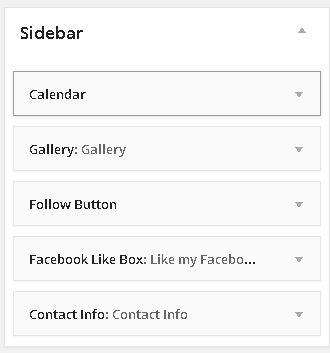
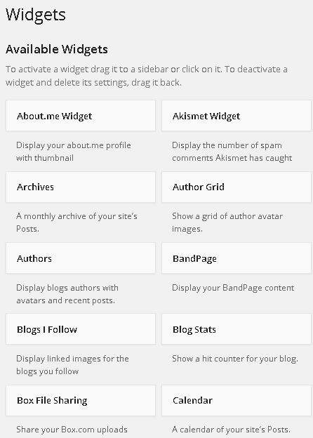
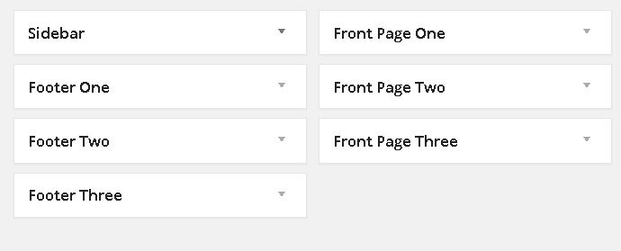
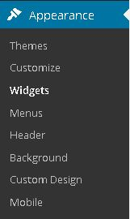
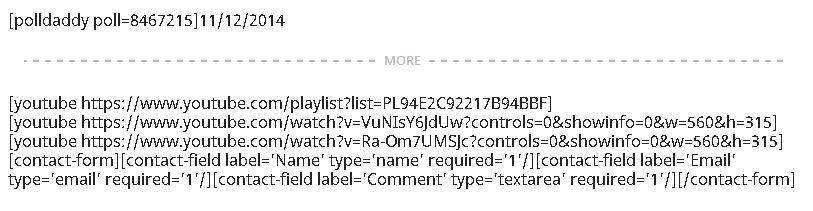
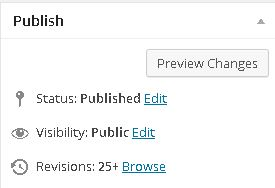
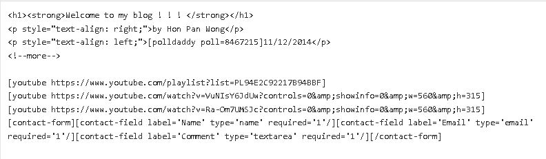
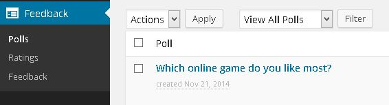

CIS440PersonalProject
=====================
Hon Pan Wong
CIS440 Personal Project

Link to website: http://wp.me/36TUb

Since my group used WordPress as the major tool to create a website for the company, 
I have learned how to use WordPress in the project. In my project, I used some widgets
/plug-ins to place the components on my website. The theme used in the website is Goran.
It is a free theme provided in WordPress. I activated the theme before doing everything
else. Then, I tried to fill up the content. On the left sidebar, "Pages" is the tab that
contains the code of the content. It has two options: Visual and Text. In the visual 
text editor, texts are styled but links are still links. The links will be real objects
on the real website. Every time I change anything in "Pages" tab, I have to click update
on the right sidebar. After that, a message asking the user to view the updated website
is shown on the top of the site. In the text editor, I am allowed to add a poll and 
Youtube links by pasting the address in the editor. A contact form can be created by one
click. Under the "Feedback" tab, I am allowed to view the result of polls and comments 
from visitors. 

The "Appearance" tab provides a wide variety of options to select and customize the theme.
Widget is one of the functions that ease the technical jobs. The website has a lot of
functions that are built using the widget tool. It acts as a pre-installed plug-in that
are ready to use for the website. The widgets I used for the website were calendar,
Gallery, Follow Button, Facebook Like Box, and Contact Info. All these widgets can be 
placed into the website by just one click. I decided to put these widgets in the sidebar
because it was easier to view and manage because they were grouped together. The widgets
can also be customized by selecting "customize" in the appearance tab. Not only the theme
and the widgets can be customized, everything in the website like header, footer, and 
background can be modified. Even though it was not easy to add media into the website,
some web coding knowledge would solve the problem.

<h2><strong>Screenshots</strong></h2>

